# Incident Manager Web Application.
This is a Incident Manager Project developed in Django Python.
The aim of this project is to create a website where developers could report bugs or errors and flag them according to their severity. And also use role-based autherization to segregate staff from the users. The working of this web-app is simple, any user can report a new incident and fill in the details and the severity of the incident, and assign it to staff, then the staff will review the incident and the developer team will start working on it to resolve the issue, the staff will mark the status as "in-progress" meaning the team is working on it, after the issue is resolved the staff will update the status as "resolved". The users cannot update the status as they are not autherized for this. The web-app is docker containerized for best consistency and deployment ease. The incident reports and all the details in it are stored in a SQLite database, outside the docker container. Gmail SMTP (Simple Mail Transfer Protocol) is used for mailing new incidents and resolved incidents to staff.

# The tools used in this project are:
Django 6.1 — backend framework, ORM, authentication, and admin interface
Django REST Framework — REST API endpoints for programmatic incident CRUD operations
SQLite — relational database for storing incident records
Bootstrap 5 — front-end styling for the incident list, detail, and form views
Docker & Docker Compose — containerization and multi-service orchestration
Gunicorn — production-grade WSGI server used inside the container
Gmail SMTP (via python-dotenv for credential management) — automated email notifications
Git & GitHub — version control and source hosting

# Screenshots
## 1. SQLite table django migrations
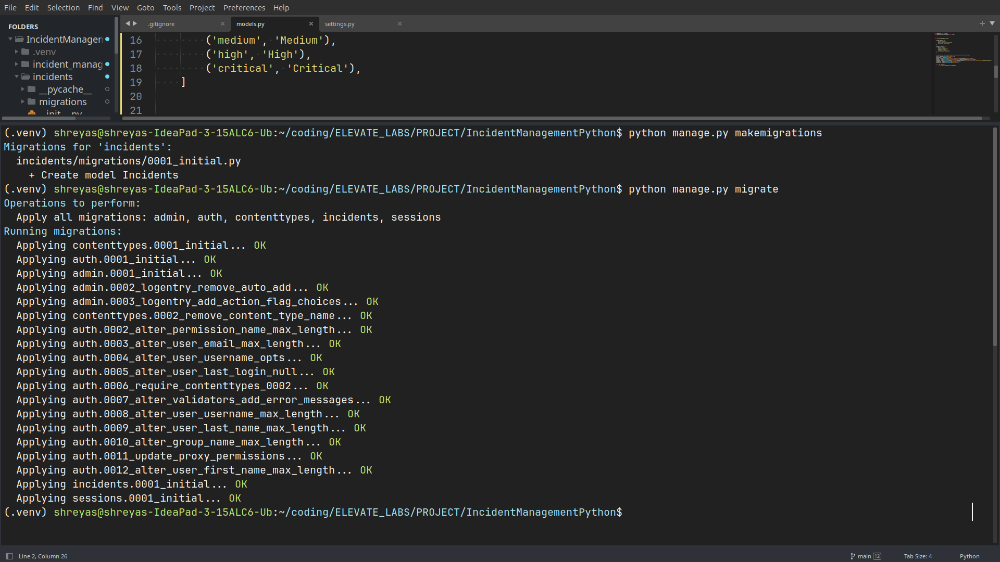

## 2. Incidents manager webpage
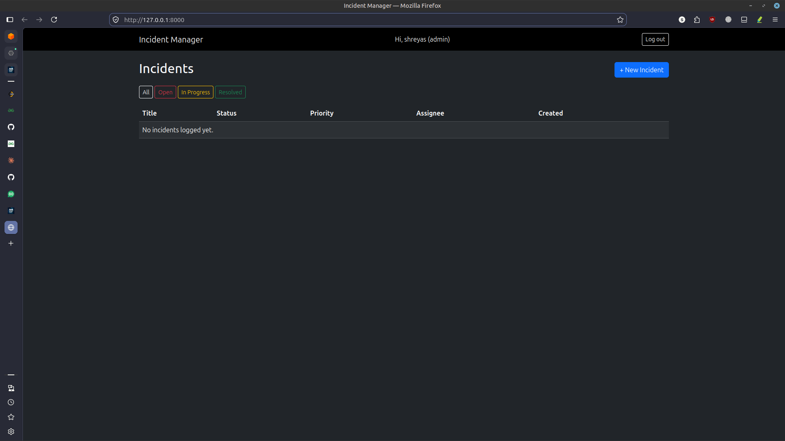

## 3. Adding users
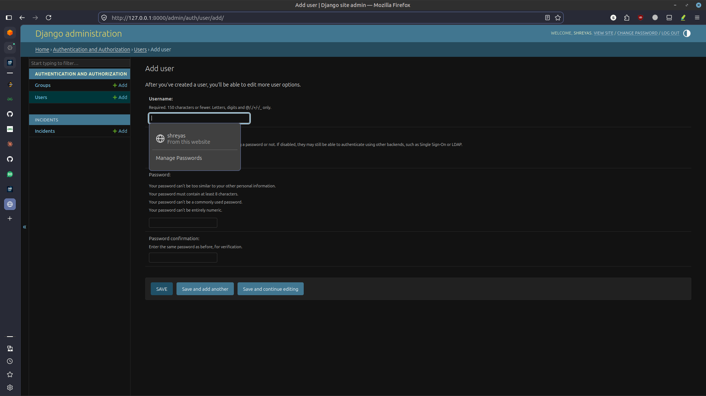

## 4. Logged in user
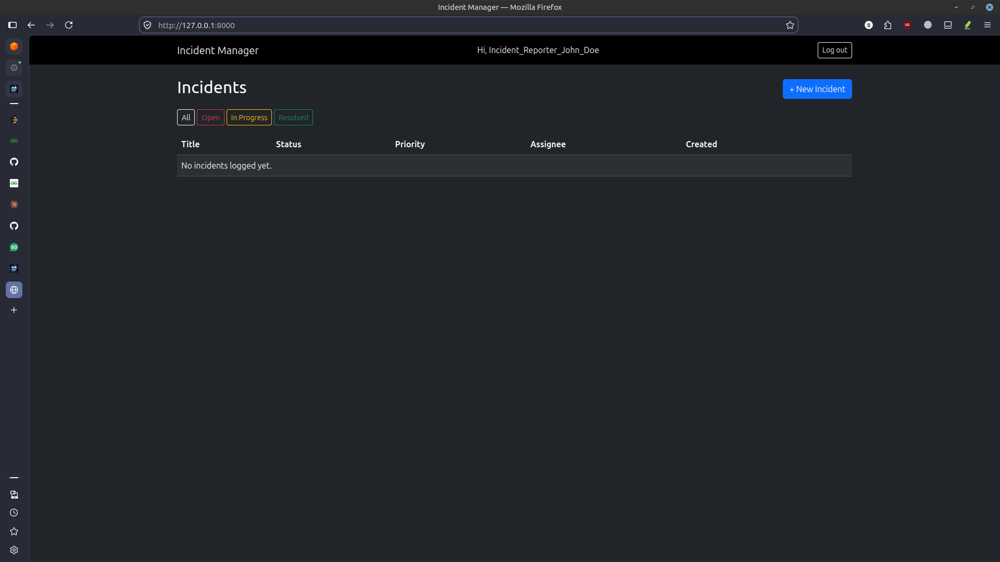

## 5. Creating incidents
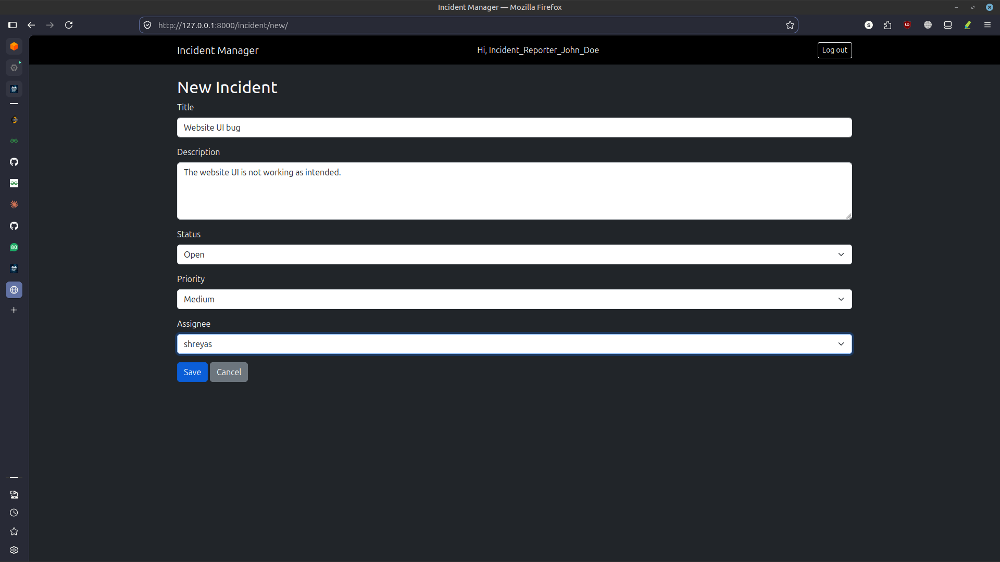

## 6. 5 incidents created
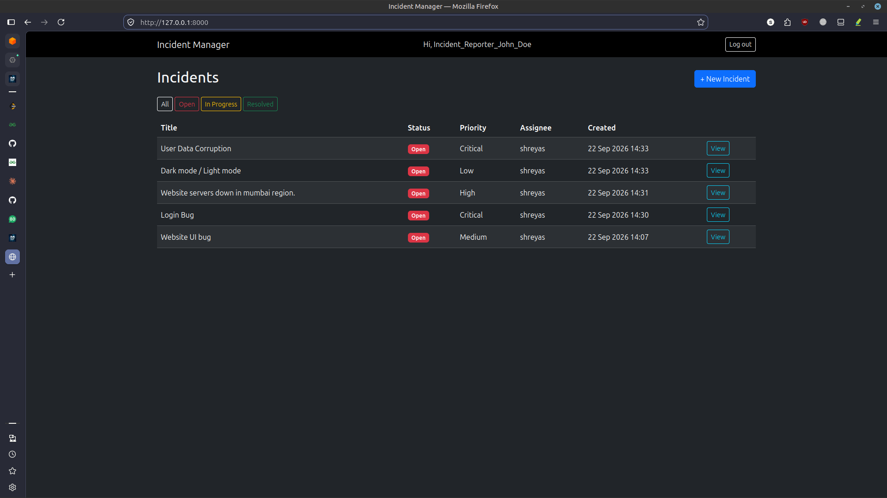

## 7. Incident mail print to console (testing the feature)
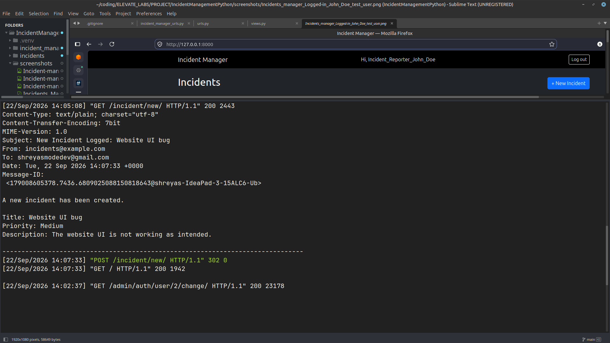

## 8. Incident report mail
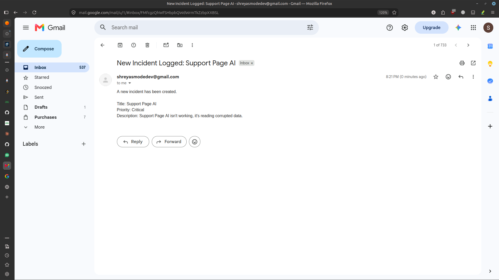

## 9. Incident status updated to resolved by admin
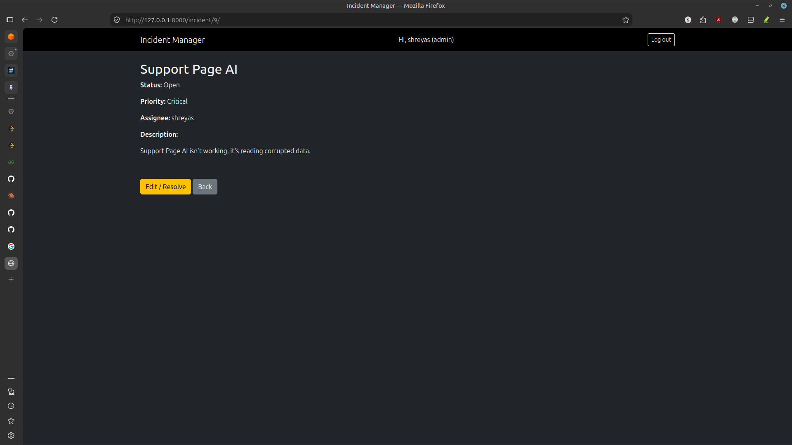
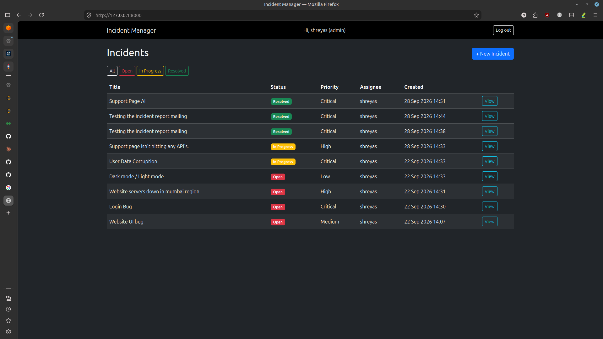

## 10. Docker containerization.
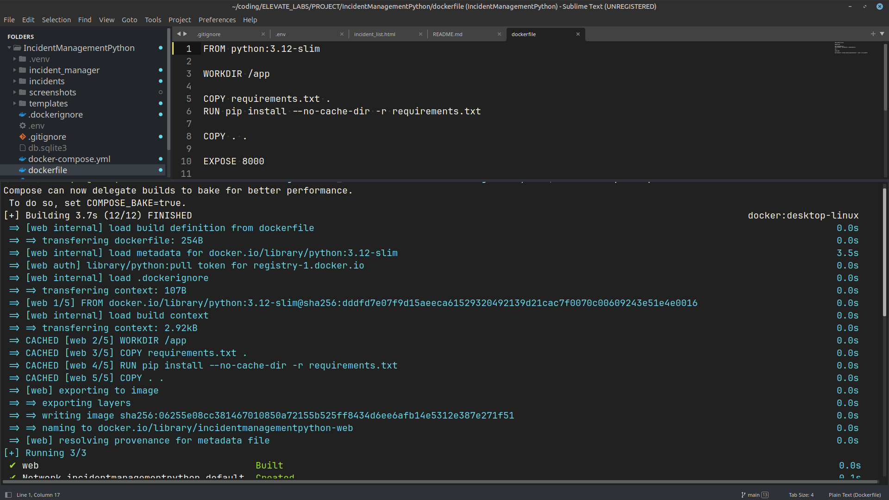

